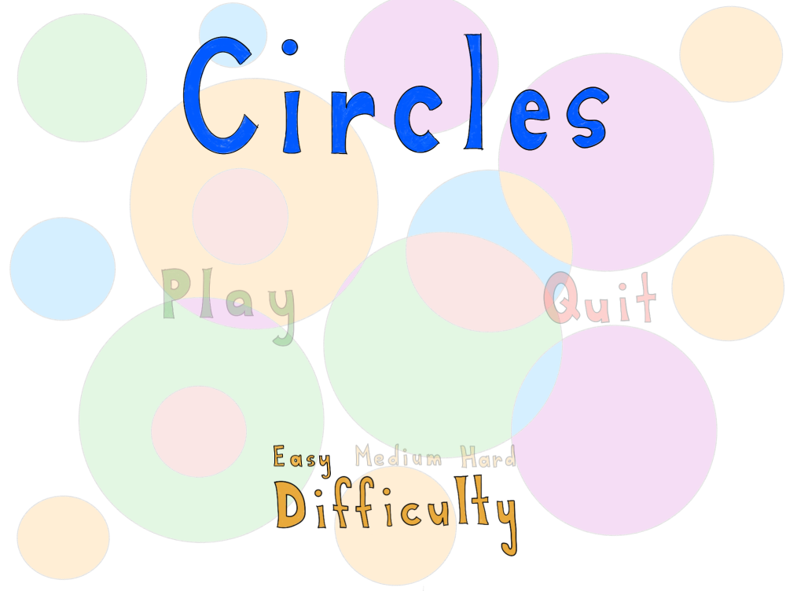
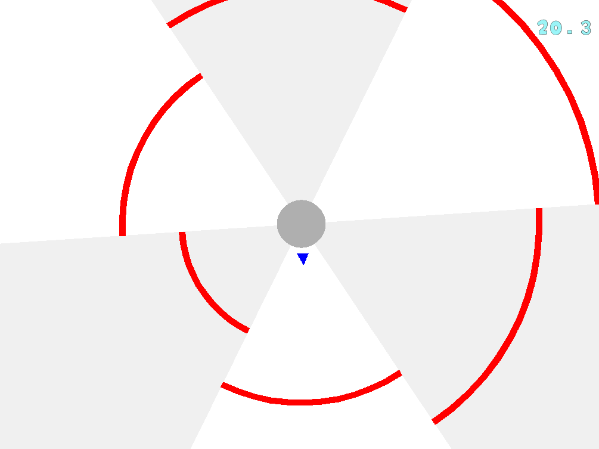
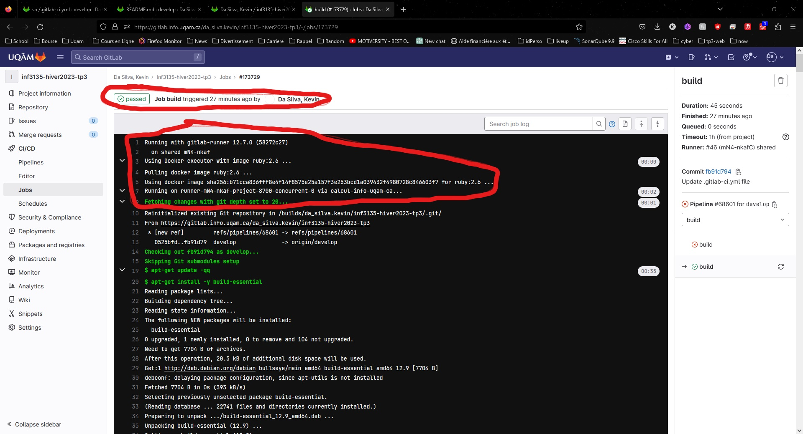
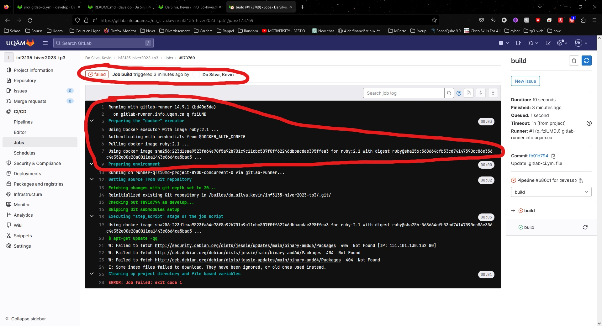

# Travail pratique 3 : Le jeu *Circles*

## Description

* Le jeu Circles s'inspire du jeu [Super Hexagon](https://www.superhexagon.com/) 
créé par [Terry Cavanagh](https://en.wikipedia.org/wiki/Terry_Cavanagh_(developer)). 
Son but est d'éviter des obstacles qui approchent le personnage de l'utilisateur (un triangle bleu) le plus longtemps possible. Le jeu comporte différents niveaux de difficulté, et la mobilité de l'utilisateur est limitée au contour d'un cercle.

* Ce travail a été réalisé dans le cadre du cours de construction et de maintenance de logiciels (INF3135) de l'Université du Québec à Montréal, enseignant Gnagnely Serge Dogny.

## Auteurs

© 2023 Tous droits réservés;

- Thai Minh Danny Nguyen (NGUT71060209)
- N'guessan Axel-Auguste Okhako (NGUA05099908)
- Kevin Da Silva (DASK30049905)

## Dépendances

* [Ubuntu 22.04](https://ubuntu.com/)
* build-essential de ubuntu
* [GCC](https://gcc.gnu.org/install/)
* [Make](https://linuxhint.com/install-make-ubuntu/)
* [SDL2](https://www.libsdl.org/)

## Fonctionnement

* Pour compiler, veuillez effectuer la commande `make` dans le terminal à l'intérieur du dossier `src`.
* Le lancement du jeu se fait avec la commande `./circles`.
* Un menu s'affichera comme l'image ci-dessous, vous permettant d'effectuer un choix parmi les possibilités suivantes :

`Play` - permet de commencer le jeu, mais l'utilisateur doit d'abord choisir une difficulté.
`Quit` - permet de quitter le jeu.
`Easy`, `Medium`, `Hard` - les différentes difficultés du jeu.
Au départ, la sélection est sur `Play` et l'utilisateur peut utiliser les flèches de son clavier de gauche à droite pour choisir entre `Play` et `Quit`. Il doit ensuite appuyer sur la touche `Enter` de son clavier pour sélectionner son choix. Parailleur, la touche `Escape` peut aider a faire un retour en arriere de laction choisi.

Une fois que l'utilisateur a choisi l'option `Play` ainsi que sa difficulté, le jeu commence et s'affiche comme l'image ci-dessous. En haut à droite se trouve un chronomètre permettant de connaître la durée pendant laquelle le joueur a survécu. Le chronomètre compte en ordre croissant et s'arrête dès que le joueur a perdu. 
 L'objectif est de rester en vie le plus longtemps possible. Au centre se trouve un cercle gris ainsi qu'un petit triangle bleu. Le triangle représente le joueur et possède une mobilité circulaire autour du cercle. 
Le jeu est séparé en six parts de tarte grises et blanches. À l'intérieur de ces parts de tarte, des lignes circulaires rouges apparaissent, qui sont des obstacles pour le joueur. Ces obstacles se rapprochent à une vitesse choisie lors de la sélection de la difficulté dans le menu : `Easy` lent, `Medium` moyen et `Hard` rapide. L'utilisateur qui contrôle le triangle a pour objectif d'éviter les obstacles à l'aide des flèches de son clavier.
      

Le jeu s'arrête et affiche "Game over" (voir l'image ci-dessous) lorsque le joueur touche un obstacle.

Si l'utilisateur souhaite mettre le jeu en pause, il peut appuyer sur la touche `Echape` et l'image suivante s'affichera. Pour continuer la partie, il suffit d'appuyer sur la touche `Enter` du clavier.

## Plateformes supportées

La plateforme officielle sur laquelle l'application a été testée est "Ubuntu 22.04". Veuillez suivre le lien dans les dépendances si nécessaire.

## Références

* [Gitignore librairie complete](https://github.com/github/gitignore)
* [Markdown](https://learn.microsoft.com/en-us/contribute/markdown-reference)
* [Code in markdown](https://learn.microsoft.com/en-us/contribute/code-in-docs)
* [tutoriels C Programming](https://www.cprogramming.com/)
* [Super Hexagone](https://en.gameslol.net/super-hexagon-933.html)

## Division des tâches

* [X] Écriture du `Readme.md`, `Makefile`, `.gitlab-ci.yml`. (Kevin)
* [X] Gestion du menu (Axel)
* [X] Affichage de facon transparente les parties non-active. (Axel)
* [X] Affichage de facon opaque l'option actuellement active. (Axel)
* [X] Gestion des sons lorsqu'on navigue dans le menu (Axel)
* [X] Affichage du cercle (Danny)
* [X] Affichage du triangle (Danny)
* [X] Animation du joueur (Danny)
* [X] Affichage du chronomètre (Danny)
* [X] Division de la carte de jeux (Kevin)
* [X] Gestion de la musique principale (Kevin)
* [X] Affichage des murs (Kevin)
* [X] Animation des murs (Kevin)
* [X] Détection des collisions (Danny - Kevin)
* [X] Affichage d'une partie terminée (Axel)
* [X] Gestion de la musique de fin de partie (Axel)
* [X] Ajout de la gestion des FPS (Axel)

## État du projet

* [X] Le projet a ete `fork`.
* [X] Votre dépôt doit se nommer exactement `inf3135-hiver2023-tp3`.
* [X] L'URL du dépôt GitLab est exactement (remplacer `utilisateur` par votre
      nom identifiant GitLab) `https://gitlab.info.uqam.ca/<utilisateur>/inf3135-hiver2023-tp3`.
* [X] Aucune variable Global(a l'exception des constantes).
* [X] Vos modification doivent compiler sans erreur et sans avertissement lorsqu'on entre `make`.
* [X] L'usagers `dogny_g` a accès au projet en mode *Maintaineur*.
* [X] Les usagers `correcteur` ont accès au projet en mode *Developer*.
* [X] Le dépôt GitLab est privé.
* [X] Le dépôt contient au moins un fichier `.gitignore`.
* [X] Le fichier `Makefile` permet de compiler le projet lorsqu'on entre `make`.
* [X] L’appel à make doit compiler et construire l’exécutable.
* [X] Les sections incomplètes de ce fichier (`README.md`) ont été complétées.
* [X] Le programme ne contient pas de valeurs magiques.
* [X] Votre travail doit être rédigé en langage C et doit compiler sans erreur et sans avertissement.
* [X] Les modifications sont réparties en commits atomiques. Utilisation des branches. Les messages de commit sont significatifs et uniformes.
* [X] Ajout d'un fichier `.gitlab-ci.yml` qui garantit que le projet compile correctement a chaque fois que quelqu'un `push` une modification
* [X] L'implemantation du code est faite a l'aide de la bibliotheque SDL2.
* [X] Toutes les ressource graphiques necessaires pour le projet sont disponibles dans le repertoire assets.
* [X] Tous les autres element du jeux sont des formes geometrique generer a laide de la bibliotheque SDL.
* [X] Le programme fonctionne sans modification sur une distribution Linux, Ubuntu, Mint ou MacOS.
* [X] La remise ce fait dans la branch main du depot git.
* [X] La date de remise limite est le 24 avril 2023 a 23h59.

## Bareme de correction

### Fonctionnabilité (60 points) 

* La correction est plafonner a 60 points.

* [X] Gestion du menu (navigation, affichage): 10 points
* [X] Affichage de la scène (triangle, murs, secteurs, disque): 10 points
* [X] Affichage du chronomètre: 10 points
* [X] Animation des murs: 10 points
* [X] Animation du joueur (triangle): 5 points
* [X] Détection des collisions: 5 points
* [X] Affichage d'une partie terminée (game over): 5 points
* [X] Gestion de difficulté: 5 points
* [X] Gestion de la musique principale: 5 points
* [X] Gestion des sons lorsqu'on navigue dans le menu: 5 points
* [X] Gestion de la musique de fin de partie (game over): 5 points

### Qualité de la remise (10 points)

* [X] Le fichier `Makefile` permet de compiler le programme: 5 points
* [X] Un fichier `.gitlab-ci.yml` qui permet de vérifier que le programme compile (c'est-à-dire que la commande make fonctionne): 5 points

### Fichier README (10 points)

* [X] Description: un résumé du projet en quelques phrases, le contexte (cours, sigle, université, etc.)
* [X] Auteurs: les auteurs, avec codes permanents
* [X] Dépendances: quels sont les logiciels et les bibliothèques à installer pour faire fonctionner l'application
* [X] Fonctionnement: décrire les commandes pour compiler le projet, pour lancer l'application et, 
      une fois démarrer, quelles sont les touches permettant de faire un choix dans le menu et de jouer.
* [X] Plateformes supportées: indiquez les distributions sur lesquelles vous avez développé le jeu
* [X] Références: s'il y a lieu, indiquez les références utilisées pour le projet
* [X] Division des tâches: indiquez comment le travail a été divisé et quelle personne a fait quelle tâche. 
      Il n'est pas nécessaire de tout faire en détails, mais il faut minimalement indiquer les tâches pour 
      lesquelles des points sont accordées dans la partie « Fonctionnabilité ».
* [X] État du projet: indiquez si le projet est fonctionnel, s'il y a des limitations.

### Gestion du projet (20 points)

* [X] Requêtes d'intégration continue.

Une erreur de la part du serveur de l'UQAM cause un problème pour l'intégration continue. 
Nous avons cherché à plusieurs reprises et effectué de nombreux tests pour finalement nous rendre compte que le problème ne vient pas de l'étudiant, mais bien du serveur Docker de l'UQAM.
Pour simplifier, lorsque GitLab est exécuté sur `gitlab-runner 14.9.1`  le serveur ayant `ruby:2.1` non mis à jour, 
notre pipeline  `(bd40e3da)` a échoué. 
Cependant, lorsque nous avons exécuté GitLab sur `gitlab-runner 12.7.0`  le serveur ayant `ruby:2.6` à jour, 
notre pipeline `(58272c27)` a réussi.

Voici dans les images ci-dessous le problème côté serveur.

## Exigences du code source 

* PS: ajout pour rendre uniforme le code, mais non-obligatoire.

* [X] Le code est intégralement en anglais.
* [X] L'indentation est uniforme.
* [X] Chaque fonction doit être documentée, Le nom de la fonction doit être significatif (refactoring).
* [X] Les identifiants de fonctions et variables doivent être uniforme.
* [X] Lisibilité du code source.
